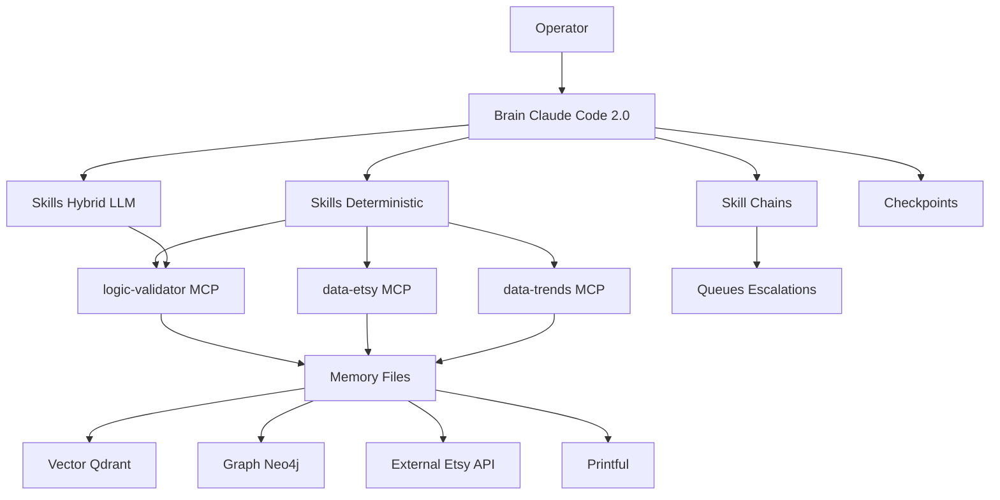

# Claude Code 2.0 POD Business Assistant — Setup Guide Architecture  
**Date:** 2025-12-07  
**Scope:** Production-ready setup for Print-on-Demand (POD) business automation on Etsy (Months 1-3 foundation), aligned with fact-check docs (Dec 2025) and SOP.

---

## Executive Summary
- **Platform choice:** Claude Code 2.0 is the primary runtime; single-session skill chains with optional subagents only when ROI-positive.  
- **Context efficiency:** Base 200K tokens; microcompact auto-cleanup (~180K), checkpoints per major decision, skill chains at 2–3K tokens each.  
- **Security:** OAuth-only secrets with AWS Secrets Manager JIT retrieval; no static keys in .env; MCP v2.0 stdio invocation; audit every MCP call.  
- **Architecture:** Five layers—Brain, Skills, MCP Tier 1/2, Data & Memory (short-term, persistent, vector, graph), External Services (Etsy API, Printful, analytics).  
- **Determinism first:** Core decisions (validate, price, SEO checks) use deterministic logic; LLM used for creative generation and formatting only.  
- **Deliverable structure:** Stepwise, verifiable, modular; each component maps to SOP workflows and includes checkpoints and troubleshooting branches.

---

## 1. Requirements Reconciliation (IDEA vs SOP)
### Mapping IDEA features to SOP workflows and components
| SOP Workflow (Months 1-3) | IDEA Component / Feature | Layer | Support Level | Notes / ROI |
| --- | --- | --- | --- | --- |
| Niche research & validation (Proc 1) | Skill **pod-research** + deterministic validate.py or logic-validator MCP | Skills + MCP | ✅ Full | GO/SKIP with Etsy counts + Trends; brand assignment; logs to validated_niches.json |
| Google Trends check | data-trends MCP (thin) or perplexity-research MCP | MCP | ✅ Full | Uses OAuth JIT; fallback heuristic if unavailable |
| Etsy competition check | data-etsy MCP (thin) or brave-search/playwright MCP | MCP | ✅ Full | Tier 2 verified; direct counts; cache |
| Design ideation (Proc 2) | Skill **design-ideation** (LLM) or **pod-design-review** | Skills | ✅ Full | Brand voice loaded from memories; deterministic scoring |
| Design prep & mockups | External: Printful mockups; Playwright MCP for scraping/mockups | External + MCP | ⚠ Partial | Automation hooks available; mockup quality still manual choice |
| Listing SEO (Proc 5) | Skill **pod-listing-seo** + logic-validator.validate_seo | Skills + MCP | ✅ Full | Deterministic SEO validation, LLM copy generation |
| Pricing formula (Proc 5) | logic-validator.calculate_price | MCP (fat) | ✅ Full | Etsy fee model, margin targets |
| Weekly cadence (5–10 listings) | Headless workflow daily-niche-discovery + chains | Brain + Workflows | ✅ Full | Batching via chains; checkpoints per batch |
| Portfolio tracking (validated niches) | memory-manager + validated_niches.json | Data & Memory | ✅ Full | Persisted, audit-ready |
| Compliance: Etsy production partner | Operational step | External | ⚠ Manual | Not automated; documented in SOP |
| Marketing (TikTok) | Out of scope Months 1-3 | — | ❌ Gap | Future phase (Months 4-6) |
| eRank usage | SOP manual tool | External | ⚠ Gap/Optional | Not in IDEA stack; can be replaced by brave/perplexity + data-etsy |

### Gaps where IDEA ≠ SOP needs
- **Marketing (TikTok) Months 4-6:** Not covered; note as future scope.  
- **eRank:** Not integrated; propose replacement via data-etsy + brave/perplexity; if required, add MCP wrapper later.  
- **Printful disclosure:** Remains manual; document checklist.  
- **Manual mockup selection:** Automation assists (Playwright) but final visual QA is manual.  

### ROI Priorities (foundation phase)
1) Deterministic validation + pricing (highest ROI, prevents bad inventory)  
2) SEO generation + validation (direct revenue impact)  
3) Memory persistence + checkpoints (token savings, repeatability)  
4) MCP reliability (OAuth, stdio v2.0)  
5) Automation hooks & headless workflows (batch efficiency)

---

## 2. System Architecture Blueprint
### Layered Model (production, Dec 2025)
- **Layer 1: Brain (Claude Code 2.0)**  
  - Orchestration, skill chains, checkpoints, microcompact, token-aware routing.  
  - Interfaces: CLI/VS Code extension; loads CLAUDE.md, skills, chains, hooks.  
- **Layer 2: Skills (Deterministic vs LLM-hybrid)**  
  - Deterministic: pod-research, pod-pricing, validate_seo (in logic-validator).  
  - Hybrid: design-ideation / pod-design-review, pod-listing-seo.  
  - Chains: full-pipeline (research → design → pricing → listing), research-only, design-only.  
- **Layer 3: MCP Servers (Tier 1 official, Tier 2 verified community)**  
  - Tier 1: filesystem, git, memory (official).  
  - Tier 2: brave-search, perplexity-research, playwright-browser, data-etsy (thin), data-trends (thin), logic-validator (fat), qdrant-vector-memory, neo4j-relationship-graph, etsy-api-integration, shopify-sync (future).  
  - Invocation: stdio, MCP spec v2.0; OAuth JIT; token rotation.  
- **Layer 4: Data & Memory**  
  - Short-term: 200K context window; checkpoints.  
  - Persistent files: .claude/memories (brand voice, validated_niches.json, skip_patterns.json).  
  - Vector: Qdrant (localhost, Docker, API-key scoped).  
  - Graph: Neo4j (localhost, Docker, password-scoped).  
  - Logs: .claude/data/logs, queues for escalations.  
- **Layer 5: External Services**  
  - Etsy API (listing CRUD, analytics), Printful (product, mockups), analytics (Shopify later), OAuth token sources (AWS SM).

### ASCII Architecture View
```
[Users/Operators]
      |
      v
[Claude Code Brain]
  | skills/chains/hooks
  v
[Skills Layer] --deterministic--> [logic-validator MCP]
   | \__hybrid LLM__/             \
   |                               -> decisions (GO/SKIP, price, SEO)
   v
[Tier 2 MCPs: data-etsy, data-trends, brave, perplexity, playwright]
   |
   v
[Data & Memory: files + Qdrant + Neo4j + logs/queues]
   |
   v
[External Services: Etsy API, Printful, analytics]
```

### Mermaid System Diagram


---

## 3. Claude Code 2.0 Feature Integration Strategy
- **Context window:** 200K base (Sonnet 4.5). Request 1M only if approved; default 200K ceiling.  
- **Microcompact:** Auto cleanup at ~180K; removes old tool artifacts, keeps CLAUDE.md + memories. Expect “[Microcompact: Freed ~65K tokens]”.  
- **Checkpoints:** After each GO decision and listing publish; use `/checkpoint "label"`; rollback via `/restore "label"`.  
- **Skill chains vs subagents:**  
  - Use skill chains by default (lower overhead, single session).  
  - Spawn subagent when batch >=3, confidence <0.75, or parent context >60K or when unbiased scoring is needed (design-reviewer, validation-specialist, price-advisor).  
- **Token optimization:**  
  - Deterministic MCP fat logic (logic-validator) instead of LLM reasoning.  
  - Thin MCPs for data fetch, fat MCP for decisions.  
  - Auto-disable unused MCP servers; use /compact sparingly; prefer checkpoints + microcompact.  
- **MCP v2.0 compliance:**  
  - Direct stdio commands (no deprecated npx for Tier 2).  
  - OAuth scopes per server; token rotation 60 min; SEP-986 naming; SEP-1319 decoupled payloads.

---

## 4. Security & Compliance Architecture
- **Credentials:** OAuth-only via AWS Secrets Manager JIT; forbid static keys in .env.  
- **MCP boundaries:**  
  - Filesystem restricted to .claude/, data/, logs.  
  - Playwright network whitelist: etsy.com, trends.google.com, printful.com, canva.com.  
  - Qdrant/Neo4j localhost-only with API key/password.  
- **Audit logging:** Log every MCP call with timestamp, server, tool, result code; store in .claude/data/logs.  
- **Rotation & TTL:** 60-minute tokens; enforce retry policies and escalate on missing credentials (no fallback to stale tokens).  
- **Data hygiene:** No API keys in prompts; redact outputs; memory files gitignored.

---

## 5. Scalability & Team Collaboration
- **Multi-user:**  
  - Central CLAUDE.md + plugin.json as source of truth; git-managed.  
  - Use checkpoints per operator session; avoid long-lived contexts.  
- **Geographic distribution:**  
  - Run Qdrant/Neo4j locally per region; sync via exports (JSON/CSV for graph, snapshots for vector) if needed.  
- **Onboarding:**  
  - Quickstart: `claude plugin install ./plugin.json`; run `.claude/scripts/mcp-health-check.sh`; execute research-only chain.  
  - Provide runbooks: validation, design, listing, pricing, fallback handling.  
- **Knowledge transfer:**  
  - Weekly memory audit; update CLAUDE.md monthly; archive validated_niches >100 entries to data/archive.  
  - Checkpoint labels standardized: `YYYYMMDD_batchX_stage`.

---

## 6. Deliverable Structure Specification (final guide layout)
1) Executive Summary (decisions, constraints, ROI)  
2) Requirements Reconciliation (IDEA vs SOP mappings, gaps, priorities)  
3) System Architecture (layers, interfaces, dependencies)  
4) Claude Code 2.0 Integration (context, checkpoints, chains/subagents, token tactics)  
5) Security & Compliance (OAuth JIT, AWS SM, MCP boundaries, audit)  
6) Data & Memory (file schemas, vector/graph setup, retention)  
7) MCP Configuration (Tier 1/2, versions, stdio commands, compatibility matrix)  
8) Skills & Chains (definitions, triggers, inputs/outputs, ROI notes)  
9) External Services Integration (Etsy, Printful, analytics)  
10) Verification & Testing (health checks, integration tests, checkpoints)  
11) Troubleshooting Decision Trees (MCP failures, token overrun, missing credentials)  
12) Implementation Phases & Dependencies (Phase 0-4 + 2.5 custom MCP)  
13) Optimization & Monthly Cycle (token spend review, memory audit)  
14) Appendices (command quickstart, file tree, diagrams)

---

## 7. Component Specifications & Interfaces
- **Brain:** CLAUDE.md (≤200 lines), hooks, chains; interfaces: `/context`, `/checkpoint`, `/restore`, `/mcp`.  
- **Skills:** SKILL.md frontmatter with triggers, max_tokens, prerequisites; deterministic scripts in `scripts/`; prompts in `prompts/`; version pin `mcp_spec_version: "2.0"`.  
- **MCP Servers:**  
  - data-etsy: `etsy_search_listings`, `etsy_get_listing_count` (thin).  
  - data-trends: `trends_get_12mo_stability`, `trends_get_related` (thin).  
  - logic-validator: `validate_niche`, `calculate_price`, `validate_seo`, `get_business_rules` (fat).  
  - qdrant-vector-memory: Docker `qdrant/qdrant:latest`, localhost 127.0.0.1:6333.  
  - neo4j-relationship-graph: Docker `neo4j:latest`, localhost 127.0.0.1:7687.  
- **Data contracts:**  
  - Validation result: `{niche, decision, confidence, etsy_count, trend_score, trend_direction?, reasoning[], brand_assignment?, sub_niches?, warnings?}`  
  - Pricing result: `{recommended_price, price_range, margin_achieved, breakdown, warnings?}`  
  - SEO result: `{valid, score, errors[], warnings[], suggestions[]}`  
- **Hooks/Queues:** post_skill confidence escalation to `.claude/queues/review_needed.jsonl`; GO decisions append to validated_niches.json.  
- **Fallbacks:** Primary MCP → alternative MCP → cache → heuristic → escalate to queue; confidence penalty on fallbacks.

---

## 8. Integration Points & Data Flows
1) Skill chain calls thin MCPs (data-etsy, data-trends) → passes raw data to logic-validator → deterministic decision → stored to memory.  
2) Listing creation: design concept + price + SEO validation → Etsy API publish via Playwright/Etsy MCP.  
3) Memory writes: GO decisions to validated_niches.json; skips to skipped_niches.json; hooks log low-confidence to queue.  
4) Vector/Graph enrichment (Phase 4 optional): store design embeddings in Qdrant; relationships in Neo4j (niche → product → listing → sales).

---

## 9. Claude Code 2.0 Context Efficiency & Token Plan
- **Budgets (per fact-check):** single validation 1.5–2.5K tokens; full pipeline 8–12K; batch 5 niches 25–30K.  
- **Reset cadence:** Checkpoint after each batch; microcompact auto; manual `/clear` after ~30 chains.  
- **Compact rules:** Do not embed large datasets; reference file paths; keep CLAUDE.md <200 lines.  
- **Skill selection:** Prefer deterministic tools; avoid verbose reasoning; enforce structured JSON outputs.

---

## 10. Security & Compliance (detailed)
- **Secrets pattern:** `aws_secretsmanager_jit`; `credential_retrieval: jit`; `token_rotation: automatic_60min`; `oauth_only: true`; `env_file_usage: forbidden`.  
- **Audit:** Log file `.claude/data/logs/mcp_calls.jsonl`; include `{timestamp, server, tool, status, duration_ms}`.  
- **Boundary controls:** Filesystem path restrictions; Playwright sandbox; Docker localhost-only for stateful stores.

---

## 11. Scalability & Team Operations
- **Multi-operator:** Use git branches per operator; do not share contexts; checkpoint naming convention; queues for escalation.  
- **Geo:** Run services locally; if shared, expose via VPN with IP allowlists; keep secrets per region.  
- **Onboarding kit:**  
  - Install: `npm install` for MCP packages, `claude plugin install ./plugin.json`.  
  - Verify: `.claude/scripts/mcp-health-check.sh`, `claude /mcp`.  
  - Run: research-only chain on sample niches.

---

## 12. Implementation Phases & Dependencies
- **Phase 0 (Foundation):** Repo structure, CLAUDE.md, brand voices, base memories. Dep: Node, Claude Code CLI, auth.  
- **Phase 1 (Core Skills):** pod-research, design-ideation, pod-pricing; tests run locally. Dep: Python3.  
- **Phase 2 (MCP Integration):** .mcp.json with stdio v2.0; install MCP packages; start Qdrant/Neo4j Docker if used; AWS SM configured.  
- **Phase 2.5 (Custom MCP Addon):** data-etsy, data-trends, logic-validator builds; plugin.json wiring; fallbacks config.  
- **Phase 3 (Automation):** Hooks, chains, headless workflows, queues.  
- **Phase 4 (Optimization):** Memory-manager expansion, feedback-analyzer, listing-seo validations, token dashboard.

---

## 13. Verification & Testing Strategy
- **Health checks:** `.claude/scripts/mcp-health-check.sh`; `claude /mcp`; Docker `curl 127.0.0.1:6333/health`, Neo4j port check.  
- **Skill tests:** Run validate.py, pricing.py, validate_seo via logic-validator MCP; confirm JSON contracts.  
- **Integration tests:** `.claude/tests/integration.test.js` (calls MCP servers).  
- **Checkpoints:** After 5 validations and after each listing batch.  
- **Acceptance for each phase:**  
  - Phase 0: structure + CLAUDE.md + memories present.  
  - Phase 1: validate.py returns GO/SKIP; pricing deterministic.  
  - Phase 2: MCPs connected; secrets resolved via JIT (no keys in files).  
  - Phase 3: hooks append to queues; headless workflow logs results.  
  - Phase 4: memory-manager persists; SEO validator catches rule violations.

---

## 14. Troubleshooting Decision Trees (summary)
- **MCP not starting:** Check stdio command, version, oauth env vault refs; run `node node_modules/.bin/<server> --help`; inspect audit log.  
- **Token overrun:** `/context` → if >180K microcompact auto; else `/checkpoint "label"` + `/clear`; reload CLAUDE.md.  
- **Credential failure:** Do not retry with stale; ensure AWS SM policy; rotate token; re-run `/mcp`.  
- **Playwright scrape blocked:** Confirm whitelist; fall back to data-etsy or cached counts; escalate to manual queue.

---

## 15. Compatibility & Version Pins (Dec 2025)
- Claude Code 2.0, Sonnet 4.5 (200K base).  
- MCP spec v2.0 (Nov 25, 2025); SEP-1024, SEP-835, SEP-986, SEP-1319.  
- Node 20.x LTS; Python 3.11+; Docker latest for qdrant/neo4j images.  
- Packages (minimum):  
  - `@anthropic-ai/mcp-server-filesystem` ^1.0.0  
  - `@anthropic-ai/mcp-server-brave-search` ^1.0.0  
  - `perplexity-mcp` ^1.0.0  
  - `@anthropic-ai/mcp-server-playwright` ^1.0.0  
  - `qdrant-mcp` ^1.0.0 or Docker `qdrant/qdrant:latest`  
  - `neo4j-mcp` ^1.0.0 or Docker `neo4j:latest`  
  - `etsy-mcp`, `shopify-mcp` ^1.0.0 (future)

---

## 16. Iterative Deployment Plan
- Start with deterministic validation + pricing + SEO checks (highest ROI).  
- Add design ideation next; then listing SEO generation.  
- Wire MCPs with OAuth JIT; enforce security early.  
- Introduce hooks/queues once validation stable; add headless batch workflow.  
- Defer vector/graph until sufficient data; keep stubs ready.

---

## 17. Monthly Optimization Cycle
- Review token spend and MCP call counts; prune unused MCPs.  
- Audit memories; archive old entries; refresh CLAUDE.md rules.  
- Re-run integration tests after any dependency upgrade.  
- Update pricing rules vs actual margins; refresh skip_patterns.

---

## Appendices
- **Quickstart commands:** `claude plugin install ./plugin.json`; `.claude/scripts/mcp-health-check.sh`; `claude /mcp`; run research-only chain.  
- **File tree reference:** see fact-check appendices (v2/v3) for canonical layout.  
- **Checkpoint labels:** `YYYYMMDD_batch##_stage`.  
- **Escalation queues:** `.claude/queues/review_needed.jsonl`, `manual_lookup.jsonl`, `manual_validation.jsonl`.

---

## How this maps to SOP ROI
- Each SOP task is covered by a skill/MCP with deterministic validation and audit trails.  
- Portfolio goals (50+ listings by Month 3) supported by headless workflows + chains; checkpoints ensure recoverability.  
- Compliance (Printful partner disclosure) noted as manual but checklist-enforced; SEO and pricing rules enforce consistency.
